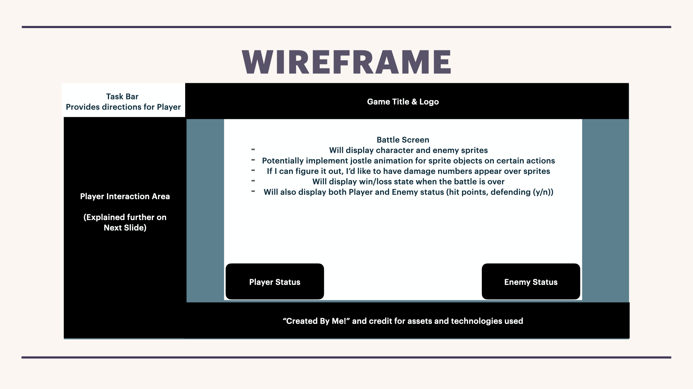
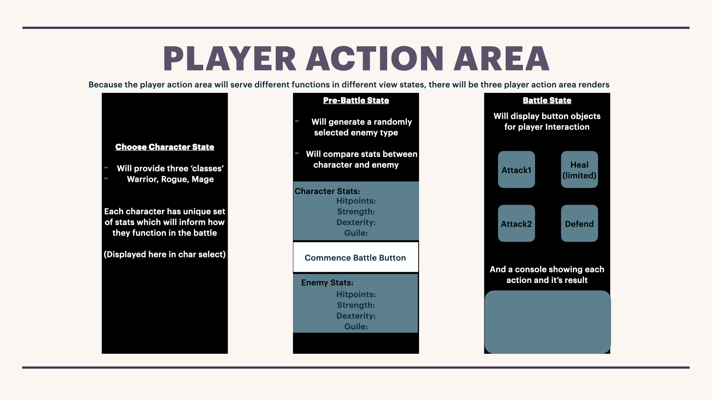
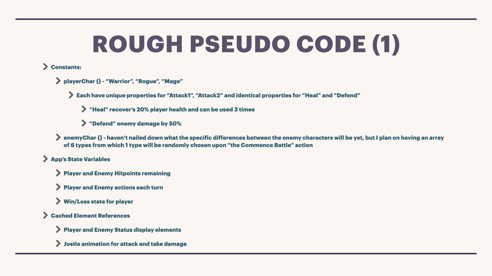
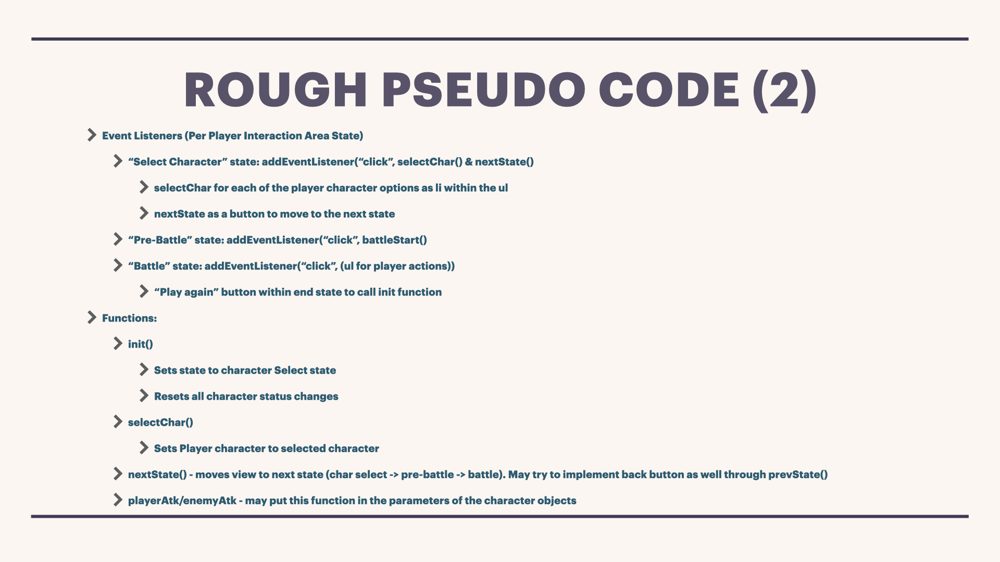
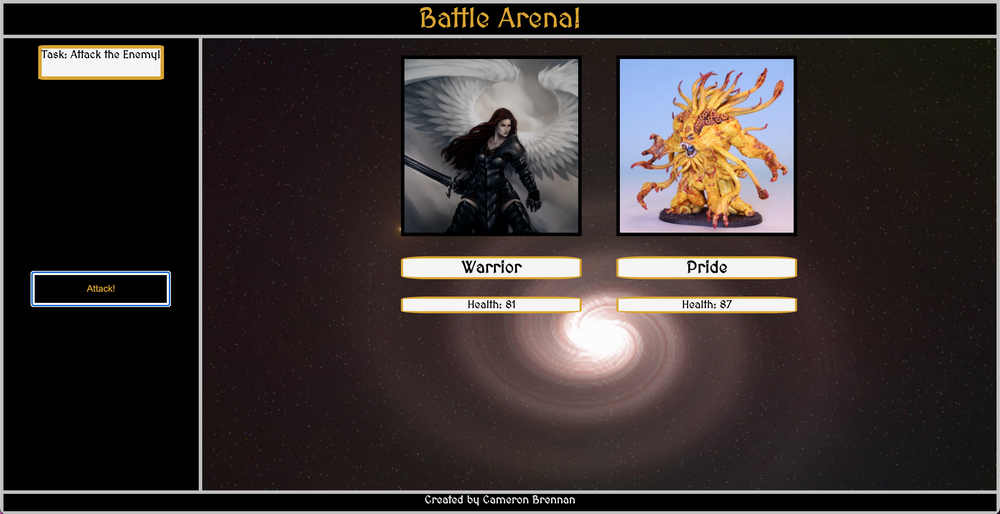
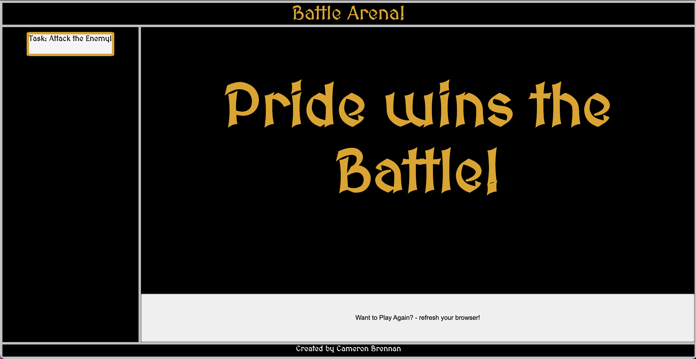

## Hello! Thank you for checking out my project - <Battle Arena!>

##### Development start date: 05/27/2021
### This is my first attempt at making a game with JS, and was inspired by the turn-based rpgs of my childhood such as "Chrono Trigger" and the Final Fantasy series.
### Please refer to the bottom of the page for a link to the gh-pages version of <Battle Arena!>, a list of technologies used, as well as credit for the avatar images that I was able to find. Please note, this game is NOT for profit and is simply a project that I am continuing to work on as I improve as an engineer.

#### During this initial phase of development, I am going to be solely focused on implementing a very basic battle arena with light RPG elements. During this stage, there will be no implementation of player selected character stats or leveling up as you would traditionally see in a role playing game, but I hope to be able to add these features down the line. For now, the game flow is listed below:

###### <space><space>*<space> Upon init, the player will choose from three available class types (the Warrior, Rogue, and Mage) which will have predetermined stat spreads that define things like Max Hitpoints and action priority, also referred to as initiative.

###### <space><space>*<space> Once the character is selected, they will move to the "pre-battle" state. Intitial build will only show a comparison of the players stats and the enemies stats (these stats will be: "Hitpoints", "Strength", "Dexterity", and "Guile"), but I am also planning on implementing a some NPCs represented as a simple, text-based, and optional dialogue system _hopefully_ as a part of the initial phase of development.

###### <space><space>*<space> Once the battle phase commences, the player character and enemy character will take turns selecting one of two attack functions and a defense function. Unique to the player character is a **heal** function, which will take one turn to recover 20% of the player character's total hitpoints. Use the healing potions wisely though - you can only take three into each battle.
###### The initiative of the player character and enemy character is calculated, and each round starts with with the action of the character with the higher initiative. Fear not, however, as the defend action will override initiative and enter the character into a **defend** state before the first character action and reduce all incoming damage by 50%
###### The battle will play out in these turns until one character's HP reaches zero, at which point there will be a "Victory!" or "Defeat..." end state as well as the options to re-initialize and play again.

###### Take a look at my wireframe models and rough pseudocode to see what the initial design concept was:

###### This is my planned game view

###### These represent the different states of the user interface nav

###### And some of the early ideas of the basic game functions and variables

#### Thank you for reading through this far, and I'm looking forward to working on and sharing the development process as it comes along!

##### _CB

#### Development Update: 06/03/2021

###### Oooooooookay, so it's been a long week of tempering my hopes with realistic implimentation limitations. I've finalized a playable version of the game though, and it's a really solid launching off point for what I hope to accomplish in the next few weeks/months as I continue to polish this and get it closer to what I originally had envisioned. Let's rip off the bandaid first and talk about the things that I was not able to impliment on the MVP version of this project:
###### <space><space>*<space> Removed user character selection and enemy character generation. In this build version, you're player is the Warrior and you are fighting the Pride Monster enemy.
###### <space><space>*<space> Character actions are limited to ONE action - "Attack!" - and character attack damage is not currently a function of that characters stats.
###### <space><space>*<space> Character sprites have been replaced with Character avatars - character health does reflect real time changes though on the status bar beneath their name.

###### As for the game itself, in it's current state it's pretty straightforward! You are the Warrior, a noble and strong but slow and non-magical character who leads the charge and you are facing the  Pride Monster - one of the only enemy characters who has as much health as the Warrior herself! Upon starting the game, your Task (as indicated to you by the Task bar) is simple: Attack your enemy! Clicking the attack button initiates a turn during which our heroine the Warrior will attack for some value between 5-25, and the Pride monster will respond in kind. Fight until your last breath, should it come to that, or emerge victorious from the <Battle Arena!>

###### All of that out of the  way, I think what I've come up with is a great first step in creating the game as it was originally conceived. My approach to starting this project was definitely macro -> micro and it's clear that this was folly. While I know that I came up with some great ideas and workable code for representing some of the basic RPG game theory in this project, the inevitable scale of having so many game state changes and including the variability that I wanted was just too much to accomplish in 7 days. From this framework and my insistance on sticking with "future feature" centered design decisions though (such as using a character class constructor, creating element templates, and the original implimentation of a gameDirector object), I think that what I set out to do is very achievable.

###### Now that I have a functioning game though, check out some of these sweet, sweet screengrabs of it in action:

###### Game starts with you facing off against the Pride Monster

###### After a few rounds of battle 

###### I can't believe I chose to use a win state where the player character lost!

##### **Last but not least** some future development plans:
##### Next Step Project Goals (in order of priority):
###### <space><space>*<space> Add character class choice (Warrior, Rogue, Mage) and random enemy generation (I've got one for each of the seven sins!)
###### <space><space>*<space> Adjust character.attack function to include game logic for stats based damage output, damage variance, and number of hits.
###### <space><space>*<space> Add multiple character actions: player(attack1, attack2, defend, heal), enemy(attack1, attack2, defend)
###### <space><space>*<space> Add a battle status screen area where the damage values and actions taken in the most recent turn are displayed
##### Longer Term Development goals:
###### <space><space>*<space> Add light animation to character avatars using CSS
###### <space><space>*<space> Add in the aforementioned NPC dialogue system, and a "Guile" stat check for certain NPC interactions
###### <space><space>*<space> Implement damage types and weaknesses (most likely with only 3 types, but potentially up to 5 which would include strength/weakness overlap)
###### <space><space>*<space> Create a player and enemy sprite that can be shown in the Battle Arena once the battle commences

###### Anyways, that's all for now as updates go. I'm going to try to update this readme with progress updates because I am DEFINITELY planning on implimenting many of the game logic ideas that I had started on moving forward!

#### GH-PAGES DEPLOYED GAME
###### https://cameronbrennan.github.io/Game-Project/

#### TECHNOLOGIES USED:
###### HTML (index.html)
###### Javascript (main.js)
###### CSS (main.css)
###### fonts.google.com use of font: Medieval Sharp
###### www.OpenGameArt.com - none of these assets made it into final product, but were used as early reference

#### CREDIT/SOURCES FOR BORROWED ASSETS:
###### Enemy character avatars: www.beastsofwar.com - Maledrakh's The Others: 7 Sins tabletop miniatures created by the Beasts of War team
###### Warrior Avatar: Artist Lucas Torquato, sourced through www.deviantart.com
###### Rogue Avatar: Taken from promotional materials for another fantasy RPG game
###### Mage Avatar: Sourced through www.deviantart.com, original artist unknown
